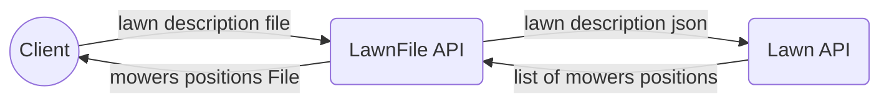

# Welcome to the Herbalizer project!
This project treats  lawn file descriptions and sends result file containing the mower's positions after mowing.
It's based on 2 APIs : 

 - LawFile API : 
	 - uploads a lawn description file
	 - checks its content
	 - sends it as json to the Lawn API
	 - treats the result received 
	 - sends the result file
- Law API:
	- receives a lawn description in json 
	- Mowes it
	- Returns the  mowers positions as json
	- 
## Files Examples
### Input file 
5 5
1 2 N
LFLFLFLFF
3 3 E
FFRFFRFRRF
### output file 
1 3 N
5 1 E

## Diagram

